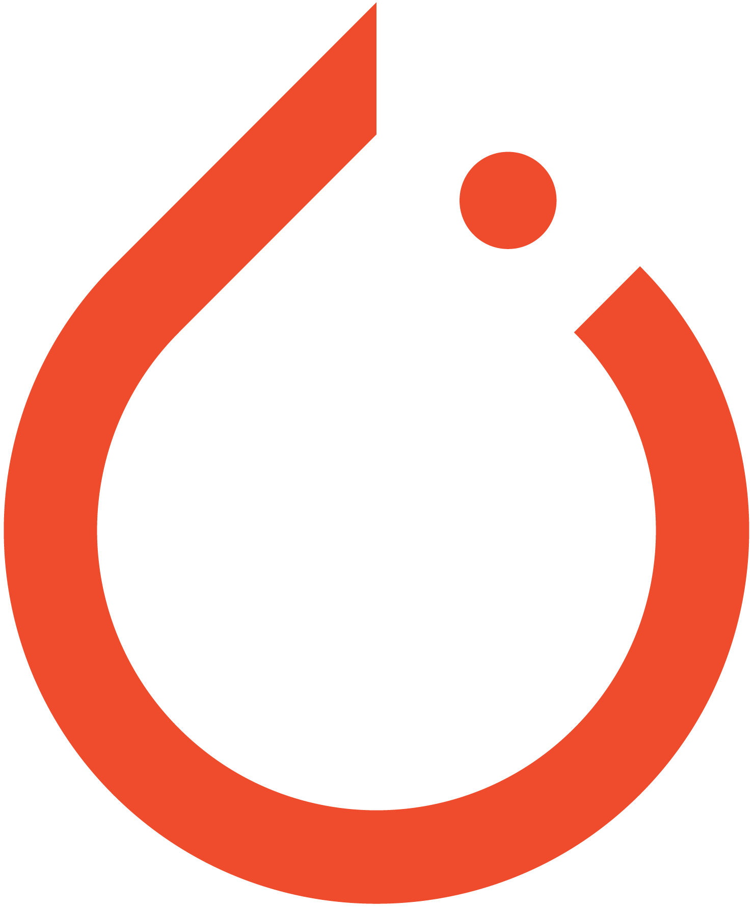

.. _intro-install:

==============
How to Install
==============

.. _faq-python-versions:

Supported Python versions
=========================

.. |py-logo| image:: ../_static/python.svg
   :height: 2ex
   :target: https://www.python.org/

BoTier requires |py-logo| Python 3.8+.

.. _intro-install-botier:

Installing BoTier
=================

.. |pypi-logo| image:: ../_static/PyPi.png
   :height: 2.5ex
   :target: https://pypi.org/project/botier/

BoTier is available as a Python package on |pypi-logo| PyPI.

You can install BoTier by simply running::

    pip install botier

We strongly recommend that you install BoTier in a dedicated virtual environment
to avoid conflicting with your system packages.

Make sure you have |torch-logo| PyTorch and |botorch-logo| BoTorch installed as well.
For installing PyTorch, refer to `here <https://pytorch.org/get-started/locally/>`_,
and for BoTorch, refer to `here <https://botorch.org/docs/getting_started>`_

Troubleshooting
===============

Please refer to `issues`_.

.. _Python: https://www.python.org/
.. _pip: https://pip.pypa.io/en/latest/installing/
.. _issues: https://github.com/fsk-lab/botier/issues