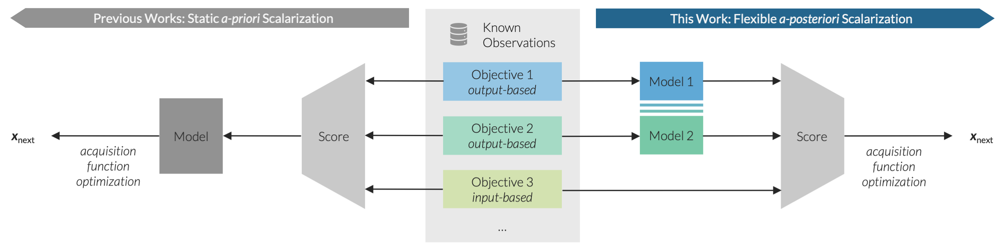

.. _intro-overview:

===============
BoTier in Brief
===============

BoTier provides a modular Bayesian Optimization framework for tackling multi-objective optimization problems,
allowing for flexible, hierarchical preferences over both input parameters and measured outputs. It is built as an open-source
extension to the BoTorch library, and enables customizable scalarization of objectives, facilitating sample-efficient
experiment planning in both synthetic and real-world scenarios.

Overview
========

The core innovation behind BoTier is its hierarchical scalarization method, which allows users to define and optimize
multi-objective problems with prioritized preferences across different objectives. BoTier is fully auto-differentiable,
enabling seamless integration with gradient-based optimization techniques, and it supports a-posteriori scalarization
for incorporating both input- and output-based objectives.

Key features of BoTier include:

* Hierarchical Scalarization: An enhanced approach to multi-objective optimization that models tiered preferences across objectives, enabling more nuanced control over trade-offs.
* A-posteriori Scalarization Strategy: A novel framework that extends traditional scalarization methods to incorporate both experiment inputs and outputs, inspired by Monte-Carlo acquisition functions
* Integration with BOTorch: BoTier is built as an extension to the widely-used BOTorch library, providing compatibility with a range of optimization and Bayesian inference tools

|
Example-Based Explanation
=========================

To better understand how BoTier works, we sugget you go through
the example at :ref:`usage-tutorial`.
