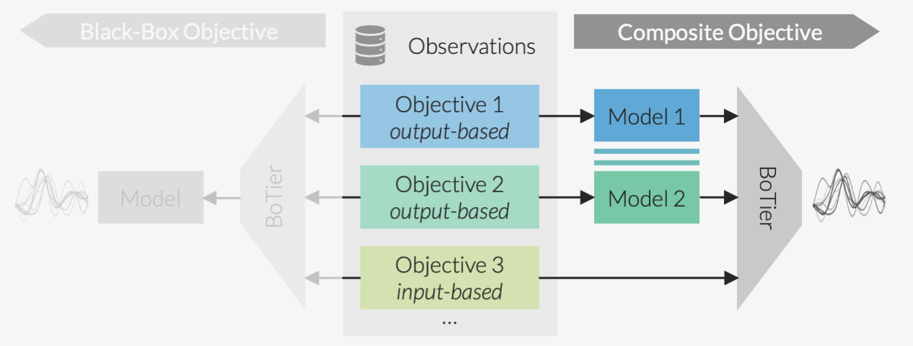

.. _intro-overview:

===============
BoTier in Brief
===============

BoTier provides a lightweight implementation of a composite objective for multi-objective optimization problems,
allowing for flexible, hierarchical preferences over both input parameters and measured outputs. It is built as an open-source
extension to the BoTorch library, and enables customizable scalarization of objectives, facilitating sample-efficient
experiment planning real-world scenarios.

Overview
========

The core functionality behind BoTier is its hierarchical scalarization method, which allows users to define and optimize
multi-objective problems with prioritized preferences across different objectives. BoTier is fully auto-differentiable,
enabling seamless integration with gradient-based optimization techniques, and it supports usage as a composite objective
that allows for incorporating both input- and output-based objectives.

Key features of BoTier include:

* Hierarchical Scalarization: A scalarization score for multi-objective optimization that covers tiered preferences across objectives, enabling more nuanced control over trade-offs.
* Automatic Differentiation: BoTier is fully auto-differentiable, allowing for seamless integration with gradient-based optimization techniques.
* Integration with BoTorch: BoTier is built as an extension to the widely-used BOTorch library, providing compatibility with a range of optimization and Bayesian inference tools.
* Composite Objective: In BoTorch's Monte-Carlo acquisition function optimization framework, BoTier can be used as a composite objective, allowing for flexible incorporation of both input- and output-based objectives.

|
Example-Based Explanation
=========================

To better understand how BoTier works, we suggest you go through
the example at :ref:`usage-tutorial`.
